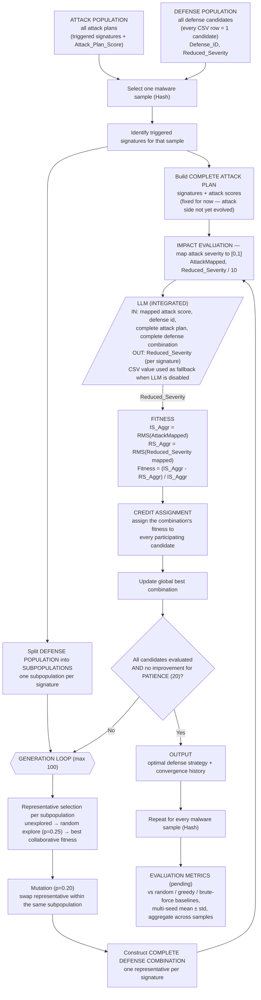

# CCEA Workflow — Attack Population + Defense Population + LLM

```mermaid
flowchart TD
    AP["ATTACK POPULATION<br/>all attack plans<br/>(triggered signatures + Attack_Plan_Score)"]
    DP["DEFENSE POPULATION<br/>all defense candidates<br/>(every CSV row = 1 candidate)<br/>Defense_ID, Reduced_Severity"]

    AP --> SEL["Select one malware sample (Hash)"]
    DP --> SEL
    SEL --> SIG["Identify triggered signatures for that sample"]

    SIG --> PLAN["Build COMPLETE ATTACK PLAN<br/>signatures + attack scores<br/>(fixed for now — attack side not yet evolved)"]
    SIG --> SUB["Split DEFENSE POPULATION into SUBPOPULATIONS<br/>one subpopulation per signature"]

    SUB --> LOOP{{"GENERATION LOOP (max 100)"}}
    LOOP --> REP["Representative selection per subpopulation<br/>unexplored &rarr; random explore (p=0.25) &rarr; best collaborative fitness"]
    REP --> MUT["Mutation (p=0.20)<br/>swap representative within the same subpopulation"]
    MUT --> COMB["Construct COMPLETE DEFENSE COMBINATION<br/>one representative per signature"]

    COMB --> MAP["IMPACT EVALUATION — map attack severity to [0,1]<br/>AttackMapped, Reduced_Severity / 10"]
    PLAN --> MAP

    MAP --> LLM[/"LLM (INTEGRATED)<br/>IN: mapped attack score, defense id,<br/>complete attack plan, complete defense combination<br/>OUT: Reduced_Severity (per signature)<br/>CSV value used as fallback when LLM is disabled"/]

    LLM -- "Reduced_Severity" --> FIT["FITNESS<br/>IS_Aggr = RMS(AttackMapped)<br/>RS_Aggr = RMS(Reduced_Severity mapped)<br/>Fitness = (IS_Aggr - RS_Aggr) / IS_Aggr"]

    FIT --> CRED["CREDIT ASSIGNMENT<br/>assign the combination's fitness to<br/>every participating candidate"]
    CRED --> BEST["Update global best combination"]
    BEST --> TERM{"All candidates evaluated<br/>AND no improvement for PATIENCE (20)?"}
    TERM -- No --> LOOP
    TERM -- Yes --> OUT["OUTPUT<br/>optimal defense strategy + convergence history"]

    OUT --> MULTI["Repeat for every malware sample (Hash)"]
    MULTI --> EVALM["EVALUATION METRICS (pending)<br/>vs random / greedy / brute-force baselines,<br/>multi-seed mean &plusmn; std, aggregate across samples"]
```
